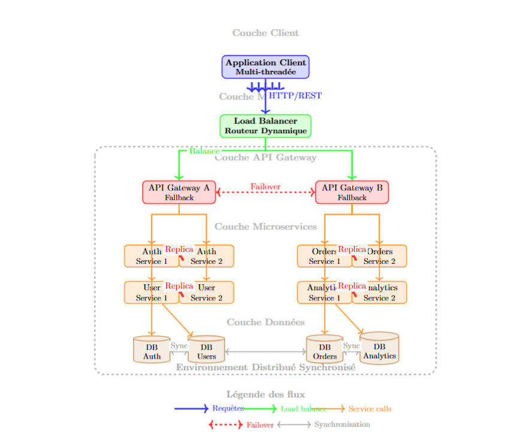

# 🏗️ DeepSeek Microservices Architecture with API Gateway

| Student Name | Class |
|---------------|--------|
| **Yesmine Zhioua** | 3 IDL 2 |
| **Ahmed Takieddine Ghrib** | 3 IDL 2 |

This document presents the evolution of the DeepSeek microservices architecture, comparing a simple approach with a single API Gateway to an advanced architecture with middleware and multiple gateways.

---

## 📋 Table of Contents
1. [Initial Architecture](#1-initial-architecture---1-api-gateway)
2. [Workflow Analysis](#2-workflow-analysis)
3. [Enhanced Architecture](#3-enhanced-architecture---middleware--2-api-gateway--parallel-fallbacks)
4. [Parallel Architecture](#4-parallel-architecture)
5. [Architecture Comparison](#5-architecture-comparison)
6. [Technical Proofs](#6-technical-proofs)
7. [7-Layer Overview](#7-7-layer-overview)
8. [Conclusion](#8-conclusion)

---

## 1. Initial Architecture - 1 API Gateway

### ✅ Advantages
- **Simplicity**: Single entry point  
- **Easy deployment and maintenance**  
- **Centralized rules** (authentication, quotas, monitoring)

### ❌ Limitations
- **Single Point of Failure (SPOF)**  
- **Limited scalability**  
- **Tight coupling** between services  
- **Larger attack surface**

### 🔧 Architecture Diagram

---

## 2. Workflow Analysis

Typical request flow:

1. **Client** → Sends request  
2. **API Gateway** → Validation  
3. **Load Balancer** → Distribution  
4. **Auth Service** → API key verification  
5. **User Service** → Quota verification  
6. **Redis Cache** → Lookup response  
   - ✅ If found: **Immediate return**  
   - ❌ Otherwise: continue processing  
7. **Chat/Core AI Service** → Context preparation  
8. **Model Service** → Model selection  
9. **Inference Service** → Response generation  
10. **Redis Cache** → Store response  
11. **Monitoring Service** → Record metrics  
12. **Return to client** (streaming or complete response)

---

## 3. Enhanced Architecture - Middleware + 2 API Gateways + Parallel Fallbacks

### 🚀 Improvements
- **Middleware Router** analyzes and routes requests to the correct gateway  
- **Load balancing** and domain isolation  
- **2 separate API Gateways** for different services  
- **Dedicated fallback system** per gateway  
- **Parallel architecture** for high availability  

### 🔧 Architecture Diagram

### ✅ Benefits
- **Reduced load** per gateway → better scalability  
- **Fault isolation**: failure of one gateway does not affect the other  
- **Enhanced security**: domain-specific rules  
- **Partial availability** in case of failure  
- **Parallelization** of services for optimal performance  

### 🔄 Fallback Examples
- **Gateway 1** → returns Redis cache for Auth/User  
- **Gateway 2** → returns degraded message for Orders  

### 🎯 Service Allocation
**API Gateway 1:** Critical authentication services  
- Auth Services (parallel)  
- User Services (parallel)  
- Quota Services (parallel)  

**API Gateway 2:** Business services  
- Orders Services (parallel)  
- Articles Services (parallel)  
- Analytics Services (parallel)  

---

## 4. Parallel Architecture

---

## 5. Architecture Comparison

| Criteria | 1 API Gateway | 2 API Gateways + Parallel Fallback |
|----------|---------------|----------------------------------|
| **Availability** | ❌ Single point of failure (SPOF) | ✅ High availability with fallbacks |
| **Resilience** | ❌ Low fault tolerance | ✅ Increased resilience with automatic fallback |
| **Performance** | ⚠️ Potential bottleneck | ✅ Load distribution, better scalability |
| **Scalability** | ❌ Limited | ✅ Horizontal with parallel services |
| **Complexity** | ✅ Easy deployment & maintenance | ⚠️ More complex: routing & fallback |
| **Security** | ⚠️ Single security layer | ✅ Two entry points with differentiated strategies |
| **Isolation** | ❌ Strong coupling | ✅ Domain-level isolation |

---
## 4. Parallel Architecture

## 6. Technical Proofs

### 🧩 Proof 1: Client-side optimization with functional separation and multithreading
The client architecture is designed to be lightweight and high-performing, with code split into independent, task-specific functions executed in separate threads.  
👉 **Result:** Faster and more robust client-side execution.

### 🌐 Proof 2: High availability via server replication
Each microservice is replicated across multiple servers. If one server fails, another instance takes over automatically.  
👉 **Result:** Load distribution and improved fault tolerance.

### ⚙️ Proof 3: Global parallelism ensured by homogeneous OS
A homogeneous system guarantees communication and synchronization consistency across nodes.  
👉 **Result:** Stable parallel execution and uniform performance.

### 🔁 Proof 4: Resilience and throughput via parallel routing and fallback
API Gateways are paired with fallback mechanisms. Parallel routing enables simultaneous handling of numerous requests.  
👉 **Result:** High resilience and optimized performance.

---

## 7. 7-Layer Overview

### Layer 1: Client
- **Role**: End-user entry point  
- **Features**: Multi-threaded application  
- **Benefits**: Improved responsiveness, multi-session support  
- **Protocols**: HTTP/REST to middleware  

### Layer 2: Middleware
- **Role**: Orchestration and load distribution  
- **Components**: Load Balancer + Dynamic Router  
- **Features**: Balanced distribution, intelligent routing, session management  
- **Benefits**: Resource optimization, horizontal scalability  

### Layer 3: API Gateway
- **Role**: Centralized API management and security  
- **Architecture**: Dual gateway with fallback  
- **Features**: Circuit breaker, caching, auth, rate limiting  
- **Redundancy**: Automatic failover  

### Layer 4: Microservices
- **Role**: Business logic split into specialized services  
- **Main Services**: Auth, User, Orders, Analytics  
- **Pattern**: Replication for high availability  
- **Benefits**: Independent deployment, granular scalability  

### Layer 5: Data
- **Role**: Data persistence and management  
- **Architecture**: Domain-specific databases  
- **Synchronization**: Replication between DBs  
- **Benefits**: Data isolation, optimized performance, consistency  

### Layer 6: AI Video Generation
- **Role**: Automated video content production  
- **Components**: AI Orchestrator, Video Engine, Render Engine  
- **Data Flow**: Analytics → Orchestrator → Feedback loop  
- **Storage**: Dedicated video and assets databases  

### Layer 7: MCP & Automation
- **Role**: External integration and task automation  
- **Components**: MCP Server, API Bridge, Workflow Engine, Task Scheduler, Monitoring Service  
- **Integrations**: Automated deployments, cross-platform monitoring, complex workflow orchestration  

### Synchronized Distributed Environment
- All layers operate in a unified environment  
- Data consistency mechanisms across services  
- **Benefits**: Global state consistency, fault tolerance, transparent horizontal scalability  

### Architecture Benefits
- Resilience and redundancy  
- Independent scalability per layer  
- Maintainability and clear separation of concerns  
- Easy integration and evolvability  
- Optimized performance  
- Extended connectivity via MCP and APIs  

### Typical Use Cases
1. **Video generation**: User → Analytics → AI → Delivered video  
2. **MCP automation**: API → Automated workflows → Monitoring  
3. **Dynamic scaling**: Load spike → Load balancer → Additional service instances  

---

## 8. Conclusion

The enhanced architecture with **middleware, multiple gateways, and parallel services** provides **better resilience, scalability, and security** thanks to:

- ✅ **Intelligent routing** via middleware  
- ✅ **Fault isolation** with independent gateways  
- ✅ **High availability** via fallback systems  
- ✅ **Optimized performance** through service parallelization  
- ✅ **Natural horizontal scalability**

This approach is ideal for critical applications requiring **high availability, performance, and flexible AI integration**.

---

*DeepSeek Technical Documentation — Advanced Microservices Architecture (Version 2.0)*
