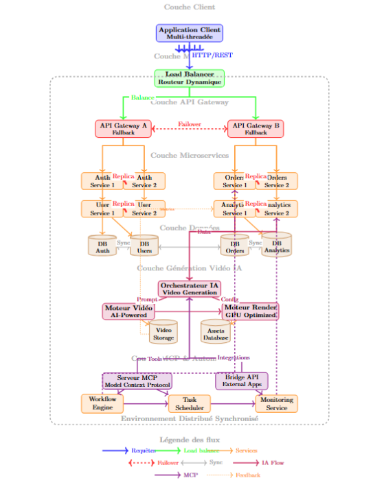

# 🏗️ Architecture Microservices DeepSeek avec API Gateway

| Student Name | Class |
|---------------|--------|
| **Yesmine Zhioua** | 3 IDL 2 |
| **Ahmed Takieddine Ghrib** | 3 IDL 2 |

Ce document présente l'évolution de l'architecture microservices de DeepSeek, comparant une approche simple avec une seule API Gateway à une architecture avancée avec middleware et multiples gateways.

---

## 📋 Table des Matières
1. [Architecture Initiale](#1-architecture-initiale---1-api-gateway)
2. [Analyse de Fonctionnement](#2-analyse-de-fonctionnement)
3. [Architecture Améliorée](#3-architecture-améliorée---middleware--2-api-gateway--fallbacks-parallèle)
4. [Architecture Parallèle](#4-architecture-parallèle)
5. [Comparaison des Architectures](#5-comparaison-des-deux-architectures)
6. [Preuves Techniques](#6-preuves-techniques)
7. [Vue d'ensemble des 7 couches](#7-vue-densemble-des-7-couches)

---

## 1. Architecture Initiale - 1 API Gateway

### ✅ Avantages
- **Simplicité** : Une seule porte d'entrée  
- **Facilité de déploiement et maintenance**  
- **Centralisation** des règles (authentification, quotas, monitoring)

### ❌ Limitations
- **Single Point of Failure (SPOF)**  
- **Scalabilité limitée**  
- **Couplage fort** entre services  
- **Surface d'attaque** plus large

### 🔧 Diagramme Architecture Initiale

---

## 2. Analyse de Fonctionnement

Flux de requête typique :

1. **Client** → Envoi requête  
2. **API Gateway** → Validation  
3. **Load Balancer** → Distribution  
4. **Service Auth** → Vérification API key  
5. **Service Utilisateurs** → Vérification quota  
6. **Cache Redis** → Recherche réponse  
   - ✅ Si trouvée : **Retour immédiat**  
   - ❌ Sinon : Suite du processus  
7. **Service Chat/Core AI** → Préparation contexte  
8. **Service Modèles** → Sélection modèle  
9. **Service Inference** → Génération réponse  
10. **Cache Redis** → Stockage réponse  
11. **Service Monitoring** → Enregistrement métriques  
12. **Retour au client** (streaming ou complet)

---

## 3. Architecture Améliorée - Middleware + 2 API Gateway + Fallbacks Parallèle

### 🚀 Améliorations Apportées
- **Middleware Router** analyse et route les requêtes vers la gateway appropriée  
- **Répartition de charge** + isolation par domaine  
- **2 API Gateways** séparées pour différents services  
- **Système de Fallback** dédié par gateway  
- **Architecture parallèle** pour haute disponibilité  

### 🔧 Diagramme Architecture Améliorée

### ✅ Avantages
- **Moins de charge** par Gateway → meilleure scalabilité  
- **Isolation des pannes** : défaillance d'une gateway n'affecte pas l'autre  
- **Sécurité renforcée** : règles spécifiques par domaine  
- **Disponibilité partielle** même en cas de panne  
- **Parallélisation** des services pour performance optimale  

### 🔄 Exemples de Fallback
- **Gateway 1** → retourne cache Redis pour Auth/User  
- **Gateway 2** → retourne message dégradé pour Orders  

### 🎯 Répartition des Services
**API Gateway 1 :** Services critiques d'authentification  
- Auth Services (parallèles)  
- User Services (parallèles)  
- Quota Services (parallèles)  

**API Gateway 2 :** Services métier  
- Orders Services (parallèles)  
- Articles Services (parallèles)  
- Analytics Services (parallèles)  

---

## 4. Architecture Parallèle

---

## 5. Comparaison des Deux Architectures

| Critère | 1 API Gateway | 2 API Gateway + Fallback Parallèle |
|----------|---------------|------------------------------------|
| **Disponibilité** | ❌ Point unique de défaillance (SPOF) | ✅ Haute disponibilité grâce aux fallbacks |
| **Résilience** | ❌ Faible tolérance aux pannes | ✅ Résilience accrue grâce au fallback automatique |
| **Performance** | ⚠️ Risque de goulot d'étranglement | ✅ Répartition de charge, meilleure scalabilité |
| **Scalabilité** | ❌ Limitée | ✅ Horizontale avec services parallèles |
| **Complexité** | ✅ Simple à déployer et maintenir | ⚠️ Plus complexe : synchronisation, routage et fallback |
| **Sécurité** | ⚠️ Une seule couche de sécurité | ✅ Deux points d'entrée : stratégies différenciées |
| **Isolation** | ❌ Couplage fort | ✅ Isolation par domaine |

---

## 🏆 Conclusion

L'architecture améliorée avec **middleware, multiples gateways et services parallèles** offre une **meilleure résilience, scalabilité et sécurité** grâce à :

- ✅ **Routage intelligent** via middleware  
- ✅ **Isolation des pannes** avec 2 gateways indépendantes  
- ✅ **Haute disponibilité** avec systèmes de fallback  
- ✅ **Performance optimisée** via parallélisation des services  
- ✅ **Scalabilité horizontale** naturelle  

---

## 6. Preuves Techniques

### 🧩 Preuve 1 : Optimisation côté client par découpage fonctionnel et multithreading
L'architecture client est conçue pour être à la fois légère et performante grâce à une division du code en fonctions indépendantes et spécifiques à une tâche donnée.  
Chaque fonction est ensuite exécutée dans un thread séparé, ce qui permet d'exploiter pleinement la puissance du processeur et d'effectuer plusieurs traitements en parallèle.  
👉 **Résultat :** exécution plus rapide et robuste côté client.

### 🌐 Preuve 2 : Haute disponibilité grâce à la réplication des serveurs
Chaque microservice est répliqué sur plusieurs serveurs. En cas de panne d’un serveur, une autre instance prend automatiquement le relais.  
👉 **Résultat :** meilleure répartition de charge et tolérance accrue aux pannes.

### ⚙️ Preuve 3 : Parallélisme global assuré par un système d'exploitation homogène
Un système homogène assure la cohérence de la communication et de la synchronisation sur tous les nœuds.  
👉 **Résultat :** exécution parallèle stable et performances homogènes.

### 🔁 Preuve 4 : Résilience et débit garantis par le routage parallèle et le fallback
Les **API Gateways** sont organisées en paires avec des mécanismes de fallback.  
Le routage parallèle permet de traiter simultanément un grand nombre de requêtes.  
👉 **Résultat :** haute résilience et performance optimisée.

---

## 7. Vue d'ensemble des 7 couches

### Couche 1: Client
- **Rôle**: Point d'entrée des utilisateurs finaux  
- **Caractéristiques**: Application multi-threadée  
- **Avantages**: Réactivité améliorée, capacité multi-session  
- **Protocoles**: Communication HTTP/REST vers middleware  

### Couche 2: Middleware
- **Rôle**: Orchestration et répartition de charge  
- **Composants**: Load Balancer + Routeur dynamique  
- **Fonctionnalités**: Distribution équilibrée, routage intelligent, gestion sessions  
- **Bénéfices**: Optimisation des ressources, scalabilité horizontale  

### Couche 3: API Gateway
- **Rôle**: Gestion centralisée des API et sécurité  
- **Architecture**: Double gateway avec fallback  
- **Fonctionnalités**: Circuit Breaker, cache, auth, rate limiting  
- **Redondance**: Failover automatique  

### Couche 4: Microservices
- **Rôle**: Logique métier découpée  
- **Services principaux**: Auth, User, Orders, Analytics  
- **Pattern**: Réplication pour haute disponibilité  
- **Avantages**: Déploiement indépendant, évolutivité granulaire  

### Couche 5: Données
- **Rôle**: Persistance et gestion des données  
- **Architecture**: Bases spécialisées par domaine  
- **Synchronisation**: Réplication entre BDD  
- **Avantages**: Isolation des données, performance, cohérence  

### Couche 6: Génération Vidéo IA
- **Rôle**: Production automatisée de contenu vidéo  
- **Composants**: Orchestrateur IA, moteur vidéo, moteur render  
- **Flux de données**: Analytics → Orchestrateur → Feedback loop  
- **Stockage**: Bases dédiées vidéos et assets  

### Couche 7: MCP & Automatisation
- **Rôle**: Intégration externe et automatisation  
- **Composants**: Serveur MCP, Bridge API, Workflow Engine, Task Scheduler, Monitoring Service  
- **Intégrations**: Déploiement automatisé, monitoring cross-platform, orchestration workflow  

### Environnement Distribué Synchronisé
- Toutes les couches opèrent dans un environnement unifié  
- Mécanismes de cohérence des données entre services  
- **Avantages**: Cohérence globale, tolérance aux pannes, scalabilité horizontale  

### Avantages de cette Architecture
- Résilience et redondance  
- Scalabilité indépendante par couche  
- Maintenabilité et découplage  
- Évolutivité et intégration facile  
- Performance optimisée  
- Connectivité étendue via MCP et APIs  

### Cas d'Usage Typiques
1. **Génération vidéo**: Utilisateur → Analytics → IA → Vidéo livrée  
2. **Automatisation MCP**: API → Workflows automatisés → Monitoring  
3. **Scaling dynamique**: Pic de charge → Load Balancer → Instances supplémentaires  

---

*Documentation technique DeepSeek — Architecture Microservices Avancée (Version 2.0)*
