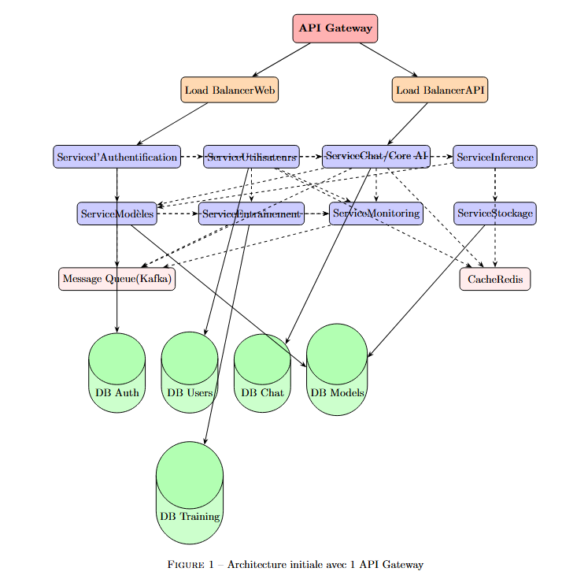
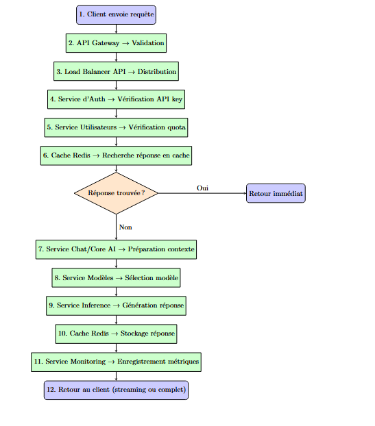
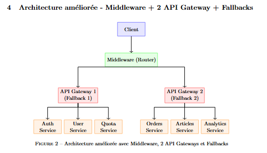
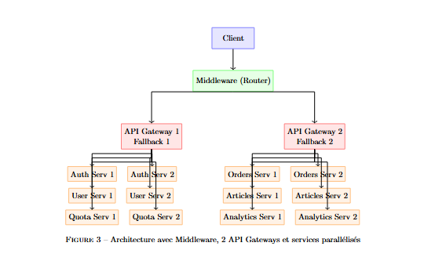

# 🏗️ Architecture Microservices DeepSeek avec API Gateway

Ce document présente l'évolution de l'architecture microservices de DeepSeek, comparant une approche simple avec une seule API Gateway à une architecture avancée avec middleware et multiples gateways.

## 📋 Table des Matières

1. [Architecture Initiale](#1-architecture-initiale---1-api-gateway)
2. [Analyse de Fonctionnement](#2-analyse-de-fonctionnement)
3. [Architecture Améliorée](#3-architecture-améliorée---middleware--2-api-gateway--fallbacks-parallèle)
4. [Comparaison des Architectures](#4-comparaison-des-deux-architectures)

## 1. Architecture Initiale - 1 API Gateway

### ✅ Avantages
- **Simplicité** : Une seule porte d'entrée
- **Facilité de déploiement et maintenance**
- **Centralisation** des règles (authentification, quotas, monitoring)

### ❌ Limitations
- **Single Point of Failure (SPOF)**
- **Scalabilité limitée**
- **Couplage fort** entre services
- **Surface d'attaque** plus large

### 🔧 Diagramme Architecture Initiale

## 2. Analyse de Fonctionnement

Flux de requête typique :

1. **Client** → Envoi requête
2. **API Gateway** → Validation
3. **Load Balancer** → Distribution
4. **Service Auth** → Vérification API key
5. **Service Utilisateurs** → Vérification quota
6. **Cache Redis** → Recherche réponse
   - ✅ Si trouvée : **Retour immédiat**
   - ❌ Sinon : Suite du processus
7. **Service Chat/Core AI** → Préparation contexte
8. **Service Modèles** → Sélection modèle
9. **Service Inference** → Génération réponse
10. **Cache Redis** → Stockage réponse
11. **Service Monitoring** → Enregistrement métriques
12. **Retour au client** (streaming ou complet)

## 3. Architecture Améliorée - Middleware + 2 API Gateway + Fallbacks Parallèle

### 🚀 Améliorations Apportées
- **Middleware Router** analyse et route les requêtes vers la gateway appropriée
- **Répartition de charge** + isolation par domaine
- **2 API Gateways** séparées pour différents services
- **Système de Fallback** dédié par gateway
- **Architecture parallèle** pour haute disponibilité

### 🔧 Diagramme Architecture Améliorée

### ✅ Avantages
- **Moins de charge** par Gateway → meilleure scalabilité
- **Isolation des pannes** : défaillance d'une gateway n'affecte pas l'autre
- **Sécurité renforcée** : règles spécifiques par domaine
- **Disponibilité partielle** même en cas de panne
- **Parallélisation** des services pour performance optimale

### 🔄 Exemples de Fallback
- **Gateway 1** → retourne cache Redis pour Auth/User
- **Gateway 2** → retourne message dégradé pour Orders

### 🎯 Répartition des Services
**API Gateway 1 :** Services critiques d'authentification
- Auth Services (parallèles)
- User Services (parallèles) 
- Quota Services (parallèles)

**API Gateway 2 :** Services métier
- Orders Services (parallèles)
- Articles Services (parallèles)
- Analytics Services (parallèles)

## 4. Architecture Améliorée - Middleware + 2 API Gateway + Fallbacks parallele

## 5. Comparaison des Deux Architectures

| Critère | 1 API Gateway | 2 API Gateway + Fallback Parallèle |
|---------|---------------|-----------------------------------|
| **Disponibilité** | ❌ Point unique de défaillance (SPOF) | ✅ Haute disponibilité grâce aux fallbacks |
| **Résilience** | ❌ Faible tolérance aux pannes | ✅ Résilience accrue grâce au fallback automatique |
| **Performance** | ⚠️ Risque de goulot d'étranglement | ✅ Répartition de charge, meilleure scalabilité |
| **Scalabilité** | ❌ Limitée | ✅ Horizontale avec services parallèles |
| **Complexité** | ✅ Simple à déployer et maintenir | ⚠️ Plus complexe : synchronisation, routage et fallback |
| **Sécurité** | ⚠️ Une seule couche de sécurité | ✅ Deux points d'entrée : stratégies différenciées |
| **Isolation** | ❌ Couplage fort | ✅ Isolation par domaine |

## 🏆 Conclusion

L'architecture améliorée avec **middleware, multiples gateways et services parallèles** offre une **meilleure résilience, scalabilité et sécurité** grâce à :

- ✅ **Routage intelligent** via middleware
- ✅ **Isolation des pannes** avec 2 gateways indépendantes
- ✅ **Haute disponibilité** avec systèmes de fallback
- ✅ **Performance optimisée** via parallélisation des services
- ✅ **Scalabilité horizontale** naturelle

Cette approche est particulièrement adaptée pour les applications critiques nécessitant une haute disponibilité et performance.

---

*Documentation technique DeepSeek - Architecture Microservices Avancée*